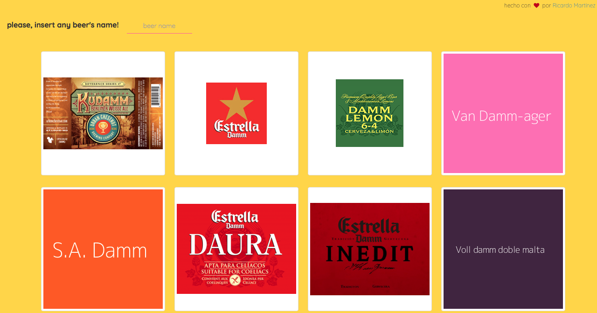

## Full Stack Web Development Bootcamp @Otoño2017

### Beer's website, con JQuery y Ajax.

Quieres saber todo acerca tu cerveza favorita? Este es un pequeño reto de JQuery y ajax.

 + [beer's website](https://mtzfactory.github.io/jquery-challenge-2/)

